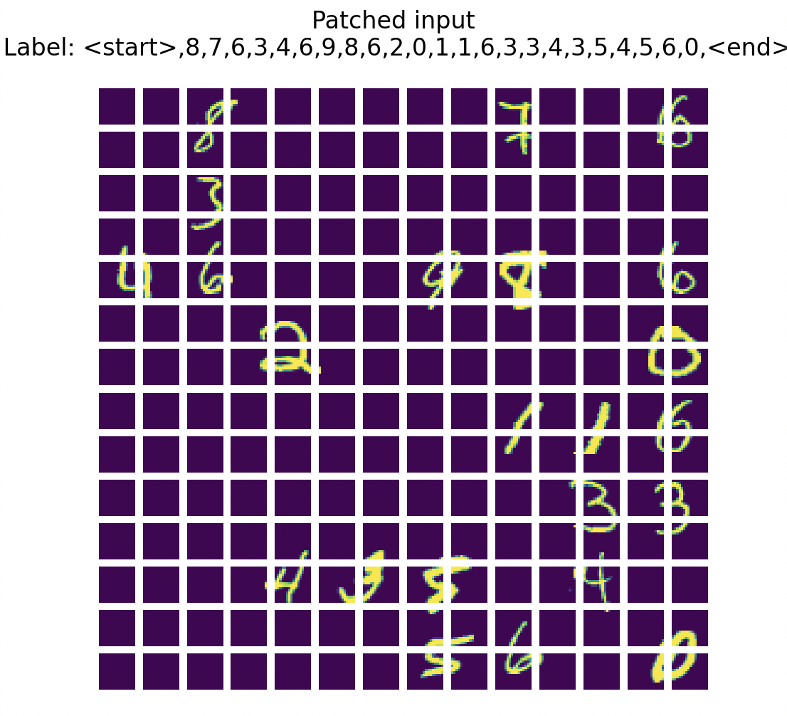

# Transformer

Task is to make an image captioning network.

We compose an image using MNIST tokens and then want to caption them.

## Dataset

MNIST

- 28 x 28

## Tasks

### Task 1: Use transformer encoder to extract an embedding for classification

Models: CNN
Loss function: Cross entropy loss

| Model                               | Number of parameters | Training time/ epoch [s] | Validation Accuracy (5 epochs) [%] |
| ----------------------------------- | -------------------- | ------------------------ | ---------------------------------- |
| CNN                                 | 61706                | 10                       | 98.6                               |
| Transformer 3 layers, 1 head        | 5092                 | 70                       | 92.0                               |
| Transformer 3 layers, 1 head (fast) | 5092                 | 30                       |                                    |
| Transformer, 12 layers, 1 head      | 18700                | 100                      | 91.4                               |
| Transformer, 12 layers, 3 heads     | 18700                | 100                      | 91.4                               |

The transformer has been implemented with learnable positional encodings.

### Task 2: OCR image captioning

The task is to use a vision transformer, trained from scratch to encode the image, and then use a transformer to decode it.

A nice baseline would be CNN-based character detector and then the MNIST classifier.

    Comparisons:
    Similarities
        -
    Differences:
        - ViT
            - is just an encoder
            - Implements
        -
    Implements Pre normalisation

## References
